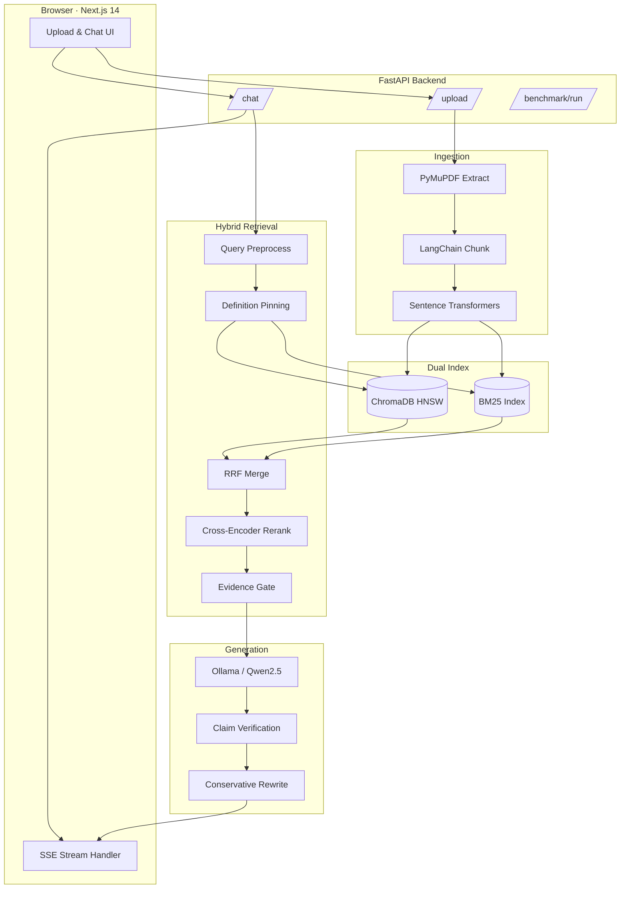

<div align="center">

# DocIntel

**GenAI document intelligence for large technical PDFs**

Upload multi-thousand-page manuals · Index with hybrid RAG · Query with grounded answers, summaries, and anomaly detection — all powered by **local LLM inference** (Ollama / Qwen2.5).

<br />

[](https://www.python.org/)
[](https://fastapi.tiangolo.com/)
[](https://nextjs.org/)
[](https://www.trychroma.com/)
[](https://ollama.com/)
[](LICENSE)

<br />

[Quick Start](#-quick-start) · [Architecture](#-architecture) · [Features](#-features) · [API](#-api-reference) · [Configuration](#%EF%B8%8F-configuration)

<br />

```
   ┌─────────────┐     ┌──────────────────────────────────┐     ┌─────────────┐
   │  Upload PDF │ ──▶ │  Hybrid RAG · Verify · Stream    │ ──▶ │  Grounded   │
   │  (PyMuPDF)  │     │  HNSW + BM25 + Rerank + Gate     │     │  Answers    │
   └─────────────┘     └──────────────────────────────────┘     └─────────────┘
```

</div>

---

## Table of contents

<details open>
<summary><strong>Navigate this README</strong></summary>

| Section | What you'll find |
|---------|------------------|
| [Why DocIntel](#-why-docintel) | Problem, approach, and design philosophy |
| [Features](#-features) | Full capability breakdown |
| [Architecture](#-architecture) | Interactive pipeline diagram |
| [Tech stack](#-tech-stack) | Backend, frontend, and ML components |
| [Quick start](#-quick-start) | Get running in minutes |
| [Usage](#-usage) | Upload, chat, benchmark workflows |
| [API reference](#-api-reference) | Endpoints and SSE events |
| [Configuration](#%EF%B8%8F-configuration) | Environment variables |
| [Project structure](#-project-structure) | Repository layout |
| [Troubleshooting](#-troubleshooting) | Common fixes |
| [License](#-license) | MIT |

</details>

---

## Why DocIntel

Technical PDFs — CPU manuals, safety reports, engineering specs — are **long**, **dense**, and **full of precise terminology**. Generic chatbots hallucinate. Simple vector search misses exact register names and cross-references.

**DocIntel** is built for that gap:

| Challenge | DocIntel response |
|-----------|-------------------|
| Thousand-page manuals | Parallel PDF extraction, page-aware chunking, batched embeddings |
| Exact terminology (`CR0.PG`, `IA32_EFER.NXE`) | BM25 keyword search + register-definition pinning |
| Semantic paraphrases | HNSW vector search (ChromaDB, cosine) |
| Noisy retrieval | Cross-encoder reranking → top-5 evidence |
| LLM hallucination | Evidence sufficiency gate · claim verification · conservative rewrite |
| Trust & transparency | Streaming UI with source citations and debug panel |

> **Privacy-first by default** — run embeddings, reranking, and LLM inference entirely on your machine. No cloud API required.

---

## Features

<table>
<tr>
<td width="50%" valign="top">

### Ingestion

- **PyMuPDF** text extraction with page metadata
- **LangChain** recursive chunking (~600 tokens, overlap)
- Parallel workers for extraction, chunking, embedding
- **ChromaDB** HNSW index + per-document **BM25** index
- Up to **200 MB** PDF uploads

</td>
<td width="50%" valign="top">

### Retrieval pipeline

- Query preprocessing (strips prompt-control noise)
- Rule-based query expansion
- **Register-definition resolver** — pins authoritative definition chunks
- Hybrid **RRF merge** (vector top-20 + BM25 top-20)
- Entity boost + definitional boost
- **Cross-encoder rerank** (`bge-reranker-large`)
- Evidence sufficiency gate before generation

</td>
</tr>
<tr>
<td width="50%" valign="top">

### Generation & trust

- Grounded prompts with strict citation rules
- **Claim verification** pass on every answer
- Auto-rewrite when >30% claims unsupported
- Low temperature for technical Q&A (`0.05`)
- OpenAI-compatible LLM client (Ollama, vLLM, etc.)

</td>
<td width="50%" valign="top">

### Application modes

- **Q&A** — streaming grounded answers with sources
- **Summarization** — structured document overview
- **Anomaly detection** — flag inconsistent parameters
- **Benchmark mode** — repeatable retrieval evaluation
- **Debug SSE** — live retrieval confidence & pinned definitions

</td>
</tr>
</table>

<details>
<summary><strong>See the full retrieval pipeline step-by-step</strong></summary>

<br />

| Step | Component | Purpose |
|------|-----------|---------|
| 1 | `query_preprocess` | Remove RULES/EVIDENCE prompt pollution |
| 2 | `query_rewriter` | Expand acronyms and register aliases |
| 3 | `register_definition_resolver` | Scan BM25 index, pin authoritative definitions |
| 4 | Vector search (HNSW) | Semantic similarity — top 20 |
| 5 | BM25 search | Keyword/exact match — top 20 |
| 6 | RRF merge | Reciprocal rank fusion |
| 7 | `entity_matcher` | Boost chunks mentioning target registers/flags |
| 8 | `definitional_boost` | Boost definitional language patterns |
| 9 | `reranker` | Cross-encoder rescore → final top 5 |
| 10 | `evidence_sufficiency` | Gate: enough evidence to answer? |
| 11 | LLM generation | Grounded answer with citations |
| 12 | Verification + rewrite | Validate claims; regenerate if needed |

</details>

---

## Architecture



<details>
<summary><strong>SSE event stream (live chat)</strong></summary>

<br />

When you send a chat message, the backend streams **Server-Sent Events**:

| Event | When | Payload |
|-------|------|---------|
| `sources` | Before generation | Retrieved chunks, scores, pinned definitions |
| `debug` | Debug mode | Retrieval metadata, boost details |
| `evidence_sufficiency` | Pre-generation | Gate verdict and confidence |
| `retrieval_confidence` | Post-retrieval | Overall retrieval quality score |
| `token` | During generation | Incremental answer text |
| `revision` | After verification | Rewritten answer (if claims unsupported) |
| `done` | Complete | Final answer, sources, verification result |
| `error` | Failure | Error message |

</details>

---

## Tech stack

<div align="center">

| Layer | Technology | Role |
|:-----:|------------|------|
| **API** | FastAPI · Uvicorn · Pydantic v2 | REST + SSE microservice |
| **Frontend** | Next.js 14 · TypeScript · Tailwind · Framer Motion | Streaming chat UI |
| **PDF** | PyMuPDF · LangChain text splitters | Extraction & chunking |
| **Vector** | ChromaDB (HNSW, cosine) | Semantic search |
| **Keyword** | rank-bm25 | Exact-term retrieval |
| **Embeddings** | Sentence Transformers (`all-MiniLM-L6-v2`) | Dense vectors |
| **Reranker** | Cross-encoder (`bge-reranker-large`) | Precision reranking |
| **LLM** | OpenAI-compatible API | Ollama + Qwen2.5 (default) |

</div>

---

## Quick start

### Prerequisites

| Requirement | Version | Notes |
|-------------|---------|-------|
| Python | 3.12+ | Backend runtime |
| Node.js | 20+ | Frontend dev server |
| [Ollama](https://ollama.com) | latest | Local LLM inference |
| GPU | optional | CUDA speeds up embeddings & reranking |

```bash
# Pull the default model
ollama pull qwen2.5:7b
```

### 1 · Clone & configure

```bash
git clone https://github.com/TensorTorch777/DocIntel.git
cd DocIntel
cp .env.example .env
```

### 2 · Backend

```bash
python -m venv .venv
source .venv/bin/activate          # Windows: .venv\Scripts\activate
pip install -r requirements.txt
uvicorn main:app --reload --host 0.0.0.0 --port 8000
```

<details>
<summary><strong>First run: what gets downloaded?</strong></summary>

<br />

On first query, DocIntel may download:

- **Embedding model** — `sentence-transformers/all-MiniLM-L6-v2`
- **Reranker** — `BAAI/bge-reranker-large` (if enabled)

Set `EMBEDDING_DEVICE=cuda` in `.env` for GPU acceleration.

</details>

### 3 · Frontend

```bash
cd frontend
npm install
cp .env.local.example .env.local
npm run dev
```

### 4 · Open the app

<div align="center">

**→ [http://localhost:3000](http://localhost:3000) ←**

Upload a PDF · Wait for indexing · Ask your first question

</div>

---

## Usage

<details>
<summary><strong>Upload a document</strong></summary>

<br />

```bash
curl -X POST http://localhost:8000/upload \
  -F "file=@/path/to/manual.pdf"
```

Response includes a `document_id` — use it for all subsequent queries.

</details>

<details>
<summary><strong>Stream a grounded Q&A answer</strong></summary>

<br />

```bash
curl -N -X POST http://localhost:8000/chat \
  -H "Content-Type: application/json" \
  -d '{
    "document_id": "YOUR_DOC_ID",
    "query": "What does CR0.PG control?",
    "task": "qa",
    "debug": true
  }'
```

Set `"debug": true` to receive retrieval metadata in the SSE stream.

</details>

<details>
<summary><strong>Run the benchmark suite</strong></summary>

<br />

Open **[http://localhost:3000/benchmark](http://localhost:3000/benchmark)** or call the API:

```bash
curl -X POST http://localhost:8000/benchmark/run \
  -H "Content-Type: application/json" \
  -d '{"document_id": "YOUR_DOC_ID"}'
```

</details>

---

## API reference

| Method | Endpoint | Description |
|:------:|----------|-------------|
| `POST` | `/upload` | Upload and index a PDF (max 200 MB) |
| `GET` | `/documents/{document_id}` | Document metadata and chunk stats |
| `POST` | `/chat` | Streaming RAG chat (SSE) |
| `POST` | `/summarize` | Structured document summary |
| `POST` | `/anomaly` | Engineering anomaly scan |
| `POST` | `/benchmark/run` | Retrieval & grounding benchmark |
| `GET` | `/health` | Service health check |

Interactive API docs (when backend is running):

- **Swagger UI** → [http://localhost:8000/docs](http://localhost:8000/docs)
- **ReDoc** → [http://localhost:8000/redoc](http://localhost:8000/redoc)

---

## ⚙️ Configuration

Copy `.env.example` → `.env` and tune the pipeline:

<details>
<summary><strong>LLM settings</strong></summary>

| Variable | Default | Description |
|----------|---------|-------------|
| `LLM_BASE_URL` | `http://localhost:11434/v1` | OpenAI-compatible endpoint |
| `LLM_MODEL` | `qwen2.5:7b` | Model name |
| `LLM_TEMPERATURE` | `0.2` | General generation temperature |
| `LLM_TEMPERATURE_TECHNICAL` | `0.05` | Q&A temperature (precise) |

</details>

<details>
<summary><strong>Retrieval & RAG pipeline</strong></summary>

| Variable | Default | Description |
|----------|---------|-------------|
| `HYBRID_RETRIEVAL_ENABLED` | `true` | Enable vector + BM25 hybrid search |
| `RETRIEVAL_CANDIDATE_K` | `20` | Candidates per retriever before merge |
| `RETRIEVAL_TOP_K` | `5` | Final chunks after reranking |
| `RERANKER_ENABLED` | `true` | Cross-encoder reranking |
| `RERANKER_MODEL` | `BAAI/bge-reranker-large` | Reranker checkpoint |
| `ENABLE_EVIDENCE_SUFFICIENCY_GATE` | `true` | Block weak-evidence answers |
| `ENABLE_REGISTER_DEFINITION_RESOLVER` | `true` | Pin authoritative definitions |
| `ENABLE_ANSWER_VERIFICATION` | `true` | Post-generation claim check |
| `ENABLE_ANSWER_REWRITE` | `true` | Regenerate if claims unsupported |
| `UNSUPPORTED_CLAIM_THRESHOLD` | `0.30` | Rewrite trigger ratio |

</details>

<details>
<summary><strong>Ingestion & performance</strong></summary>

| Variable | Default | Description |
|----------|---------|-------------|
| `CHUNK_SIZE` | `2400` | Characters per chunk (~600 tokens) |
| `CHUNK_OVERLAP` | `480` | Overlap between chunks |
| `EMBEDDING_DEVICE` | `cuda` | `cuda` or `cpu` |
| `EMBEDDING_BATCH_SIZE` | `512` | Embedding batch size |
| `PDF_EXTRACTION_WORKERS` | `8` | Parallel PDF workers |

> **Note:** Changing chunk settings requires **re-uploading** PDFs to rebuild indexes.

</details>

---

## Project structure

```
DocIntel/
├── app/
│   ├── routers/          # upload, chat, documents, benchmark
│   ├── services/
│   │   ├── ingestion.py          # PDF → chunks → indexes
│   │   ├── retrieval.py          # Hybrid pipeline orchestrator
│   │   ├── bm25_store.py         # Per-document BM25 index
│   │   ├── vector_store.py       # ChromaDB HNSW
│   │   ├── reranker.py           # Cross-encoder reranking
│   │   ├── register_definition_resolver.py
│   │   ├── evidence_sufficiency.py
│   │   ├── definitional_boost.py
│   │   ├── entity_matcher.py
│   │   ├── query_preprocess.py
│   │   ├── query_rewriter.py
│   │   └── rag.py                # Generation, verification, SSE
│   └── models/           # Pydantic schemas
├── frontend/
│   ├── app/              # Next.js pages (home, benchmark)
│   ├── components/       # ChatPanel, RetrievedSources, Hero, …
│   └── lib/              # API client, types, utils
├── main.py               # FastAPI entry point
├── requirements.txt
├── .env.example
└── README.md
```

Runtime data (`data/`, ChromaDB, uploads) is **gitignored** — created locally on first upload.

---

## Troubleshooting

<details>
<summary><strong>Frontend 404 / 500 on static chunks</strong></summary>

<br />

Corrupted `.next` cache (often after `npm run build` while dev server is running):

```bash
cd frontend && rm -rf .next && npm run dev
```

</details>

<details>
<summary><strong>BM25 / hybrid search not working on old uploads</strong></summary>

<br />

BM25 indexes are built at ingestion time. Re-upload PDFs after enabling `HYBRID_RETRIEVAL_ENABLED` or changing chunk settings.

</details>

<details>
<summary><strong>CUDA / GPU not detected</strong></summary>

<br />

Set `EMBEDDING_DEVICE=cpu` in `.env` if no NVIDIA GPU is available. Embeddings and reranking will run on CPU (slower but functional).

</details>

<details>
<summary><strong>Ollama connection refused</strong></summary>

<br />

Ensure Ollama is running and the model is pulled:

```bash
ollama serve          # if not already running
ollama pull qwen2.5:7b
curl http://localhost:11434/v1/models
```

</details>

---

## License

MIT © [Nimish Vadgaonkar](LICENSE) — see [LICENSE](LICENSE) for details.

---

<div align="center">

**Built for engineers who need answers grounded in the manual — not guesses from the model.**

<br />

If DocIntel helps your workflow, consider giving the repo a star on GitHub.

<br />

[⬆ Back to top](#docintel)

</div>
