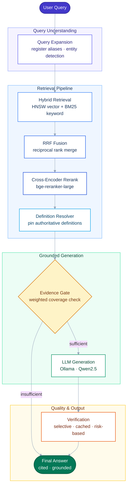

<div align="center">

# DocIntel

**Domain-aware technical RAG for large-scale manuals**

Hybrid retrieval · evidence gating · verification

[](https://www.python.org/)
[](https://fastapi.com/)
[](https://nextjs.org/)
[](LICENSE)

</div>

---

## Overview

DocIntel is a **document-grounded question-answering system** built for dense technical PDFs — CPU architecture manuals, safety specifications, and engineering references where exact register names, bit positions, and procedural sequences matter.

Unlike generic RAG demos, DocIntel combines **keyword + vector hybrid retrieval**, **cross-encoder reranking**, **authoritative definition pinning**, **evidence sufficiency gating**, and **selective answer verification** to reduce hallucinations while keeping latency practical on local hardware (Ollama / Qwen2.5).

---

## Architecture



| Stage | Implementation |
|-------|----------------|
| Query expansion | Rule-based register/entity expansion (`query_rewriter`) |
| Hybrid retrieval | ChromaDB HNSW + BM25, top-20 each |
| RRF | Reciprocal rank fusion (`k=60`) |
| Rerank | `BAAI/bge-reranker-large` cross-encoder |
| Definition resolver | Pins authoritative register-definition chunks |
| Evidence gate | Weighted coverage thresholds before generation |
| LLM | OpenAI-compatible API (Ollama `qwen2.5:7b`) |
| Verification | Risk-based selective verify + cache |

---

## Features

- **Hybrid retrieval** — vector + BM25 with RRF merge
- **Cross-encoder reranking** — precision-focused top-k selection
- **Register definition resolver** — pins authoritative definition passages
- **Evidence sufficiency gating** — abstains when coverage is insufficient
- **Procedural reasoning** — query-aware step extraction and ordering
- **Selective verification** — skips low-risk / authoritative-definition answers
- **Hallucination mitigation** — claim verification + conservative rewrite path

---

## Running Locally

### Prerequisites

- Python 3.12+
- Node.js 20+
- [Ollama](https://ollama.com) with `qwen2.5:7b`
- Optional: CUDA GPU for embeddings/reranking

```bash
ollama pull qwen2.5:7b
```

### 1. Clone and configure

```bash
git clone https://github.com/TensorTorch777/DocIntel.git
cd DocIntel
cp .env.example .env
```

### 2. Backend

```bash
python3 -m venv .venv
source .venv/bin/activate
pip install -r requirements.txt
uvicorn main:app --reload --host 0.0.0.0 --port 8000
```

### 3. Frontend

```bash
cd frontend
npm install
cp .env.local.example .env.local
npm run dev
```

Open **http://localhost:3000** — upload a PDF, wait for indexing, then chat.

---

## Project structure

```
DocIntel/
├── app/                    # FastAPI backend (RAG, retrieval, verification)
├── frontend/               # Next.js 14 UI
└── main.py                 # API entry point
```

---

## License

MIT — see [LICENSE](LICENSE).
