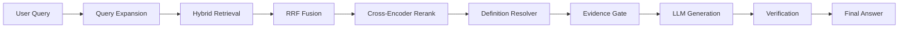

<div align="center">

# DocIntel

**Domain-aware technical RAG for large-scale manuals**

Hybrid retrieval · evidence gating · verification · 516-case benchmark suite

[](https://www.python.org/)
[](https://fastapi.com/)
[](https://nextjs.org/)
[](LICENSE)

</div>

---

## Overview

DocIntel is a **document-grounded question-answering system** built for dense technical PDFs — CPU architecture manuals, safety specifications, and engineering references where exact register names, bit positions, and procedural sequences matter.

Unlike generic RAG demos, DocIntel combines **keyword + vector hybrid retrieval**, **cross-encoder reranking**, **authoritative definition pinning**, **evidence sufficiency gating**, and **selective answer verification** to reduce hallucinations while keeping latency practical on local hardware (Ollama / Qwen2.5).

**Primary evaluation document:** Intel SDM–style manual (`516` benchmark cases).

---

## Architecture



| Stage | Implementation |
|-------|----------------|
| Query expansion | Rule-based register/entity expansion (`query_rewriter`) |
| Hybrid retrieval | ChromaDB HNSW + BM25, top-20 each |
| RRF | Reciprocal rank fusion (`k=60`) |
| Rerank | `BAAI/bge-reranker-large` cross-encoder |
| Definition resolver | Pins authoritative register-definition chunks |
| Evidence gate | Weighted coverage thresholds before generation |
| LLM | OpenAI-compatible API (Ollama `qwen2.5:7b`) |
| Verification | Risk-based selective verify + cache (Sprint 3) |

See [docs/architecture.md](docs/architecture.md) for retrieval, grounding, and benchmark flows.

---

## Features

- **Hybrid retrieval** — vector + BM25 with RRF merge
- **Cross-encoder reranking** — precision-focused top-k selection
- **Register definition resolver** — pins authoritative definition passages
- **Evidence sufficiency gating** — abstains when coverage is insufficient
- **Procedural reasoning** — query-aware step extraction and ordering
- **Selective verification** — skips low-risk / authoritative-definition answers (~50% of cases)
- **Hallucination mitigation** — claim verification + conservative rewrite path
- **Benchmark suite** — 516 cases across 6 categories with CSV/JSON exports and reports

---

## Benchmark Results

**Latest run:** `benchmark/results/sprint3_full_516/` (2026-05-31)

| Metric | Result |
|--------|-------:|
| Cases | 516 |
| Recall@K | 95.1% |
| MRR | 0.848 |
| NDCG@K | 94.8% |
| Hallucination rate | 4.5% |
| Citation accuracy | 70.3% |
| Citation coverage / sentence | 68.4% |
| Abstention precision / recall | 38.7% / 95.8% |
| Avg latency | 1854 ms |
| Verification latency | 424 ms (50.2% cases skipped) |

Full report: [benchmark/reports/benchmark_report.md](benchmark/reports/benchmark_report.md)

<details>
<summary><strong>Category breakdown</strong></summary>

| Category | Recall@K | Must-contain | Hallucination |
|----------|---------:|-------------:|--------------:|
| definition_queries | 95.6% | 61.9% | 6.8% |
| procedural_queries | 79.3% | 63.5% | — |
| multihop_queries | 97.5% | 62.5% | — |
| entity_collision_queries | 95.8% | 40.0% | 0% |
| adversarial_queries | 90.9% | 100% | — |
| insufficient_evidence_queries | 100% | 100% | — |

</details>

---

## Screenshots

<!-- Add screenshots after deployment -->
| Chat UI | Benchmark dashboard |
|---------|---------------------|
| _Screenshot placeholder_ | _Screenshot placeholder_ |

---

## Running Locally

### Prerequisites

- Python 3.12+
- Node.js 20+
- [Ollama](https://ollama.com) with `qwen2.5:7b`
- Optional: CUDA GPU for embeddings/reranking

```bash
ollama pull qwen2.5:7b
```

### 1. Clone and configure

```bash
git clone https://github.com/TensorTorch777/DocIntel.git
cd DocIntel
cp .env.example .env
```

### 2. Backend

```bash
python3 -m venv .venv
source .venv/bin/activate
pip install -r requirements.txt
uvicorn main:app --reload --host 0.0.0.0 --port 8000
```

### 3. Frontend

```bash
cd frontend
npm install
cp .env.local.example .env.local
npm run dev
```

Open **http://localhost:3000** — upload a PDF, wait for indexing, then chat.

### 4. Run benchmarks

```bash
# Full 516-case suite (requires indexed document)
.venv/bin/python benchmark_runner.py \
  --document-id <YOUR_DOCUMENT_ID> \
  --output-dir benchmark/results/latest

# Generate reports
.venv/bin/python benchmark/generate_report.py
.venv/bin/python benchmark/definition_failure_analysis.py
.venv/bin/python benchmark/citation_audit.py
```

---

## Project structure

```
DocIntel/
├── app/                    # FastAPI backend (RAG, retrieval, verification)
├── frontend/               # Next.js 14 UI
├── benchmark/              # 516-case suite, metrics, reports
│   ├── benchmark_cases.json
│   ├── reports/            # Auto-generated RC reports
│   └── results/            # JSON + CSV run outputs
├── docs/                   # Architecture, resume bullets, audit
├── benchmark_runner.py     # CLI benchmark entry point
└── main.py                 # API entry point
```

---

## Documentation

| Document | Description |
|----------|-------------|
| [docs/architecture.md](docs/architecture.md) | Retrieval, grounding, benchmark flows |
| [RELEASE_NOTES.md](RELEASE_NOTES.md) | Sprint 1–3 changelog and metrics |
| [benchmark/reports/benchmark_report.md](benchmark/reports/benchmark_report.md) | Latest benchmark summary |
| [benchmark/reports/definition_failures.md](benchmark/reports/definition_failures.md) | Definition accuracy investigation |
| [benchmark/reports/citation_audit.md](benchmark/reports/citation_audit.md) | Citation coverage audit |
| [docs/repo_audit.md](docs/repo_audit.md) | Release-candidate code audit |

---

## License

MIT — see [LICENSE](LICENSE).
