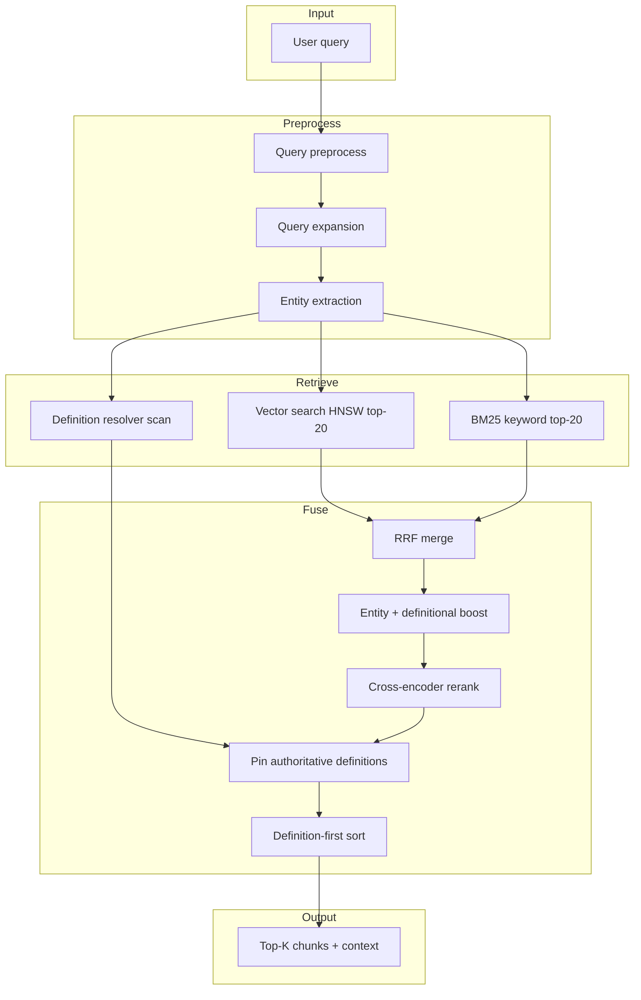
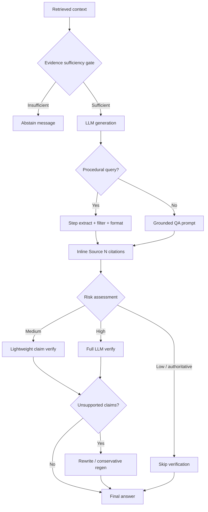
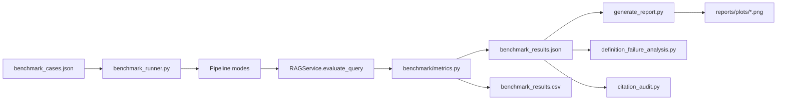

# DocIntel Architecture

Domain-aware technical RAG pipeline for large PDF manuals. This document describes retrieval, grounding, and benchmark evaluation flows.

---

## Retrieval flow

### Key modules

| Module | Path | Role |
|--------|------|------|
| Query preprocess | `app/services/query_preprocess.py` | Strip prompt noise |
| Query rewriter | `app/services/query_rewriter.py` | Register/alias expansion |
| Vector store | `app/services/vector_store.py` | ChromaDB HNSW |
| BM25 store | `app/services/bm25_store.py` | Per-document keyword index |
| Definition resolver | `app/services/register_definition_resolver.py` | Authoritative definition pinning |
| Reranker | `app/services/reranker.py` | Cross-encoder scoring |
| Retrieval orchestrator | `app/services/retrieval.py` | Full hybrid pipeline |

---

## Grounding flow

### Grounding controls

| Control | Purpose |
|---------|---------|
| Evidence sufficiency gate | Blocks generation when weighted coverage is below threshold |
| QA system prompt | Requires `[Source N]` per factual claim |
| Procedural path | Template `Step N:` answers with mandatory citations |
| Answer verification | LLM JSON verify for unsupported claims |
| Selective verification | Skips ~50% of low-risk cases (Sprint 3) |
| Conservative rewrite | Regenerates when unsupported ratio exceeds threshold |

### Citation model

Sources are numbered `1..K` in context order (`format_context` in `retrieval.py`). Answers must cite `[Source N]` inline. Benchmark citation metrics measure sentence coverage, valid indices, and lexical alignment (`app/services/citation_support.py`).

---

## Benchmark flow

### Benchmark categories (516 cases)

| Category | Count | Focus |
|----------|------:|-------|
| definition_queries | 132 | Register/flag definitions |
| entity_collision_queries | 60 | Disambiguation |
| procedural_queries | 37 | Ordered steps |
| multihop_queries | 80 | Multi-chunk reasoning |
| adversarial_queries | 54 | Prompt injection resistance |
| insufficient_evidence_queries | 46 | Abstention behavior |

### Metrics tracked

- **Retrieval:** Recall@K, MRR, NDCG@K (capped at 1.0)
- **Quality:** must_contain, hallucination rate, citation accuracy
- **Definition funnel:** retrieved → selected → used → correct
- **Procedural:** ordered step accuracy, extra step rate, precision/recall
- **Latency:** retrieval, rerank, generation, verification (per stage)

---

## Configuration

Primary settings in `.env` — see `.env.example` for coverage weights, verification cache, procedural limits, and pipeline toggles.
